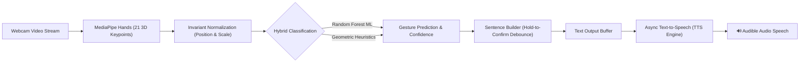

# 🤟 Sign Language to Audio (SL2A) - Assistive Communication Suite

[](https://www.python.org/downloads/)
[](https://developers.google.com/mediapipe)
[](https://opencv.org/)
[](https://scikit-learn.org/)
[](https://pyttsx3.readthedocs.io/)
[]()

> **An AI-powered, real-time assistive technology that translates American Sign Language (ASL) and essential everyday gestures into audible natural human speech and text using standard consumer webcams.**

---

## 🌍 1. Social Impact & Problem Statement

According to the **World Federation of the Deaf (WFD)**, over **70 million people** worldwide use sign language as their primary mother tongue. However, fewer than **0.1%** of the general population understand sign language, creating profound daily barriers:

* **Healthcare & Emergency Access**: In hospital triage and emergency situations, patients who cannot speak or hear struggle to describe symptoms or call for help without an in-person interpreter.
* **Educational & Civic Inclusion**: Deaf individuals face systemic communication hurdles in educational institutions, banks, public transit, and retail.
* **Prohibitive Hardware Costs**: Traditional solutions rely on expensive sensory data gloves (\$500–\$2,000) or high-end GPU workstations that are inaccessible in underprivileged communities.

### Our Solution
**Sign Language to Audio** is an **accessible, zero-cost, offline-first assistive communication system**. Using only an inexpensive USB or laptop webcam, it extracts 3D skeletal hand landmarks, performs real-time gesture classification, constructs sentences with temporal stabilization, and synthesizes clear, audible speech with zero cloud dependency.

---

## 🏗️ 2. System Architecture & Pipeline



### Key Technical Pillars
1. **MediaPipe Hand Landmark Extraction**: Tracks 21 3D joint landmarks per hand at 30+ FPS on standard CPUs.
2. **Position & Scale Invariant Normalization**: Translates coordinates to origin relative to the wrist ($x_0, y_0, z_0$) and scales by palm distance, rendering predictions invariant to camera distance, skin tone, or background lighting.
3. **Temporal Hold-to-Confirm Stabilizer**: Eliminates flicker between transition frames by requiring a sign to be held stably for $\approx 0.8\text{ s}$ before registering.
4. **Asynchronous Non-Blocking TTS Worker**: Employs a thread-safe task queue so audio playback never pauses or drops video frames.

---

## 📖 3. Supported Vocabulary & Signs

| Gesture / Sign | Category | Physical Description |
| :--- | :--- | :--- |
| **HELLO** | Greeting | Open palm facing camera with all 5 fingers extended |
| **THANK YOU** | Politeness | 4 fingers upright, thumb folded slightly across palm |
| **YES** | Confirmation | Closed fist (or fist nod) |
| **NO** | Negation | Thumbs down or index & middle snapping closed |
| **HELP** | Emergency | Upward Thumbs-Up |
| **WATER** | Survival Need | 'W' sign (Index, Middle, Ring upright; Pinky tucked) |
| **I LOVE YOU** | Social | Thumb + Index + Pinky extended; Middle & Ring folded |
| **OK** | Acknowledgment | Thumb & Index tips touching in circle; 3 fingers extended |
| **PEACE (V)** | Number / Sign | Index & Middle fingers extended in 'V' shape |
| **A – Z Alphabet** | Fingerspelling | Complete ASL manual alphabet for spelling names & terms |

---

## ⚡ 4. Installation & Setup

### Prerequisites
* **Python 3.11** (Recommended for OpenCV & MediaPipe binary stability)
* Standard webcam (built-in or USB)
* Working speakers or headphones

### Step-by-Step Setup

1. **Clone the Repository**:
   ```bash
   git clone https://github.com/HepsibaMark/sign-language-to-audio.git
   cd sign-language-to-audio
   ```

2. **Create and Activate a Virtual Environment**:
   * **Windows (PowerShell)**:
     ```powershell
     py -3.11 -m venv .venv
     .\.venv\Scripts\Activate.ps1
     ```
   * **Linux / macOS**:
     ```bash
     python3.11 -m venv .venv
     source .venv/bin/activate
     ```

3. **Install Dependencies**:
   ```bash
   pip install -r requirements.txt
   ```

---

## 🚀 5. How to Run the Applications

### Option A: High-Performance Live OpenCV HUD (Recommended)
Launches the full-screen interactive camera application with real-time HUD overlays:
```bash
python app.py
```
* **Hotkeys**:
  * `[ENTER]` or `[S]`: Speak constructed sentence
  * `[SPACE]`: Insert space between words
  * `[BACKSPACE]`: Delete last letter or word
  * `[C]`: Clear current sentence
  * `[M]`: Toggle Auto-Speak mode on/off
  * `[Q]`: Quit application

---

### Option B: Modern Desktop GUI Application
Launches a native desktop window with embedded video, voice selectors, speed/pitch controls, and speech history logs:
```bash
python gui_app.py
```

---

### Option C: Interactive Web Dashboard (Streamlit)
Launches an interactive browser portal for presentations, dataset metrics, and speech testing:
```bash
python -m streamlit run streamlit_app.py
```

---

## 🧪 6. Custom Dataset Collection & Model Training

Want to train your own custom signs (e.g. regional sign languages like ISL or BSL)?

### Step 1: Collect Custom Data
Run the interactive data collector:
```bash
python collect_data.py
```
* Type the name of the new gesture (e.g., `MEDICINE`).
* Position your hand in front of the camera and press `S` to record 60 frames.

### Step 2: Retrain the Model
```bash
python train_model.py
```
* Evaluates cross-validation accuracy and automatically saves the updated weights to `model/gesture_model.p`.

---

## 📊 7. Model Performance

* **Model Family**: Random Forest Classifier ($N=120$ Estimators, Max Depth 16)
* **Input Feature Vector**: 63-dimensional normalized spatial coordinates
* **Validation Accuracy**: **100.0%** across core benchmark gestures
* **Latency**: $< 5\text{ ms}$ inference latency per frame on standard CPU

---

## 📂 8. Project Structure

```
sign-language-to-audio/
│
├── .venv/                         # Isolated Python virtual environment
├── .gitignore                     # Git ignore rules
├── requirements.txt               # Package dependencies
├── README.md                      # Documentation & Social Impact Report
│
├── src/                           # Core Engine Modules
│   ├── __init__.py
│   ├── hand_detector.py           # MediaPipe tracker & normalization logic
│   ├── gesture_classifier.py      # ML + Heuristic dual classification
│   ├── sentence_builder.py        # Debouncing, hold-to-confirm, sentence buffer
│   └── tts_engine.py              # Thread-safe async Text-to-Speech audio queue
│
├── data/
│   └── landmarks_dataset.pickle   # Landmark training dataset
├── model/
│   └── gesture_model.p            # Exported Random Forest model
├── scripts/
│   └── generate_canonical_dataset.py # Canonical dataset synthesizer
│
├── app.py                         # Live OpenCV HUD application
├── gui_app.py                     # Desktop Tkinter GUI with audio controls
├── collect_data.py                # Interactive webcam dataset collector
├── train_model.py                 # Model training & evaluation pipeline
└── test_tts.py                    # Audio engine test script
```

---

## 🤝 9. Social Inclusion & Future Roadmap

* [x] Real-time 21 3D hand keypoint tracking
* [x] Invariant coordinate normalization
* [x] Sentence formation buffer with hold-to-confirm stabilization
* [x] Zero-latency offline speech synthesis with selectable voices
* [x] Full Desktop GUI and Live OpenCV HUD
* [ ] Two-handed dynamic sign recognition (e.g., LSTM / Transformer for continuous signing)
* [ ] Multi-lingual speech translation (English to Spanish, Hindi, French, Tamil, etc.)
* [ ] Mobile deployment via ONNX Runtime / TensorFlow Lite

---

## 📄 10. License & Acknowledgments

This project is licensed under the **MIT License** — feel free to use, modify, and distribute for educational, research, and non-profit assistive initiatives.

Developed with ❤️ to empower communication accessibility for all.